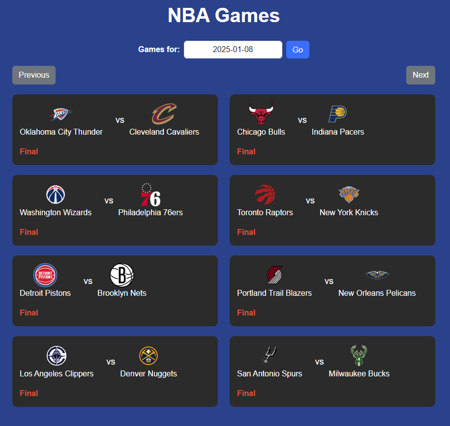
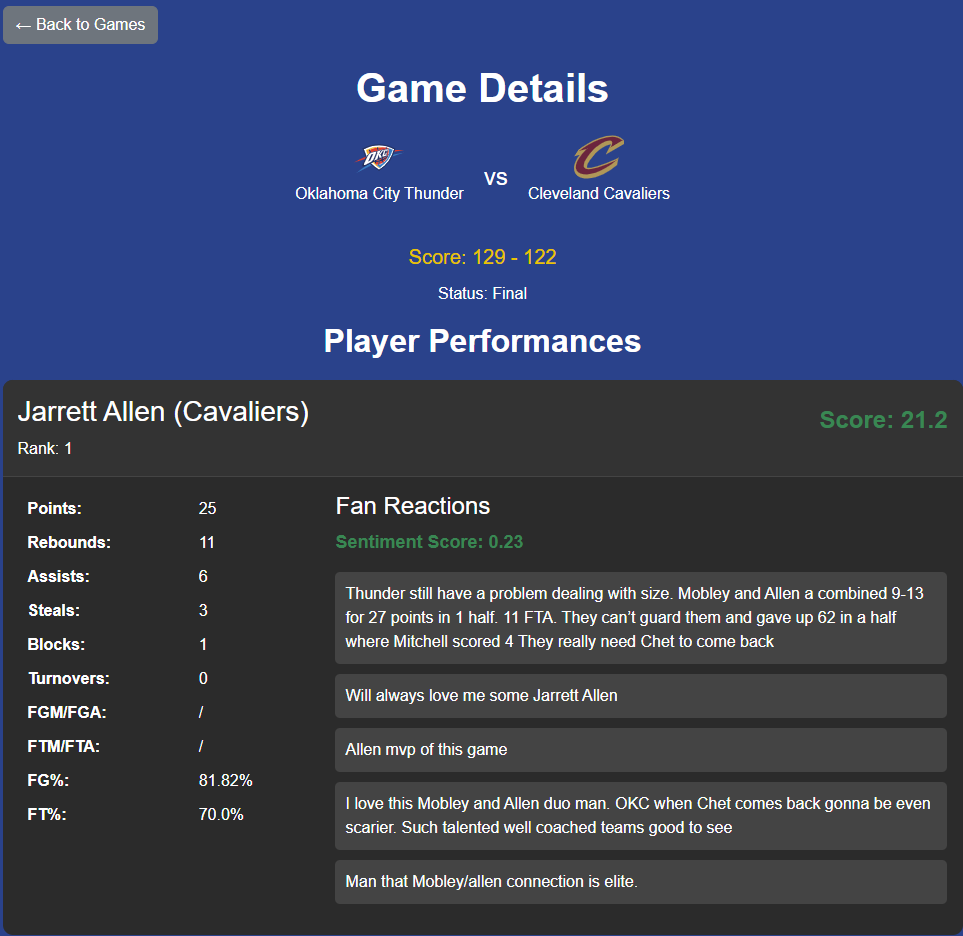

# NBA Game Tracker

**NBA Game Tracker** is a Flask web application that tracks live NBA games, player performances, and fan reactions. It uses the NBA API and Reddit API to provide detailed statistics and sentiment analysis.

---

## Features

- **Game Tracking**: View live updates for NBA games with team logos and scores.
- **Player Statistics**: Analyze player performances with metrics such as points, rebounds, assists, and a calculated performance score.
- **Fan Sentiment**: Extract and analyze fan comments from Reddit game threads using sentiment analysis.

---

## Technology Stack

- **Frontend**: HTML, CSS (Bootstrap 5), Jinja2 Templates.
- **Backend**: Flask (Python).
- **APIs**:
  - [NBA API](https://github.com/swar/nba_api): Fetch live game data and statistics.
  - [Reddit API (PRAW)](https://www.reddit.com/dev/api/): Extract comments and threads for sentiment analysis.
- **Sentiment Analysis**: VADER Sentiment Analysis.

---

## Installation

1. **Clone the Repository**:
   ```bash
   git clone https://github.com/your-username/nba-game-tracker.git
   cd nba-game-tracker
   ```

2. **Set Up Virtual Environment**:
    ```bash
    python -m venv venv
    source venv/bin/activate
    ```

3. **Install Dependencies**:
    ```bash
    pip install -r requirements.txt
    ```

4. **Add API Keys**:
    ```bash
    reddit = praw.Reddit(
    client_id="your-client-id",
    client_secret="your-client-secret",
    user_agent="nba_tracker by /u/your-username"
    )
    ```
5. **Run the Application**:
    ```bash
    python app.py
    ```

## Screenshots

### Home Page
List of games with team logos and scores.



### Game Details
Detailed player stats and fan sentiment analysis for a specific game.




